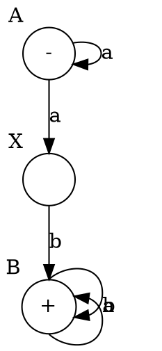
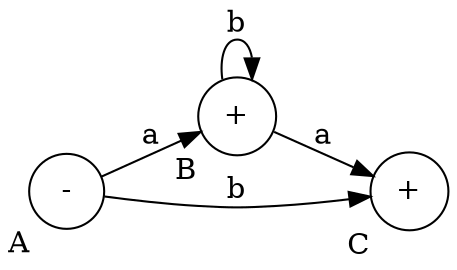
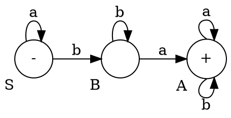

## 1. True/false

1. $L = a^*ba^*$
	- $ab$ is a member of $L$: 
	- $ba$ is a member of $L$:
	- $\lambda$ is a member of $L$:
	
## 2. Complete the table.

<table>
<tr><th>Language</th><th>FA</th><th>CFG</th></tr>

<tr>
<td>

$$
\begin{aligned}
L &= a^*(a+b)b^* \\
  &= \{ a, b, aa, ab, bb, aab, abb, aaab, aabb, abbb, ... \}
\end{aligned}
$$
</td>
<td>

</td>
<td>

$$
\begin{aligned}
&A \to aA | aX \\
&X \to bB \\
&B \to bB | aB | \lambda \\
\end{aligned}
$$
</td>
</tr>

<tr>
<td>

$$
\begin{aligned}
L &= \{ b, a, ab, abb, ..., aa, aba, abba, ...\} \\
  &= b + ab^* + ab^*a
\end{aligned}
$$
</td>
<td>

</td>
<td>

$$
\begin{aligned}
&A \to aB | bC \\
&B \to \lambda | aC | bB \\
&C \to \lambda
\end{aligned}
$$
</td>
</tr>

<tr>
<td>

$$
\begin{aligned}
L &= \{ a, aa, ... \} \{ b, bb, ... \} \{ a, aa, aaa, ab, abb, ... \} \\
  &= a+b+ab^*
\end{aligned}
$$
</td>
<td>

</td>
<td>

$$
\begin{aligned}
&S \to aS | bB \\
&B \to bB | aA \\
&A \to aA | bA | \lambda
\end{aligned}
$$
</td>
</tr>
</table>

## 3. Find the language of each CFG.

$$
1. \ \ 
\begin{aligned}
&S \to aA | bB \\
&A \to aA | \lambda \\
&B \to bB | \lambda
\end{aligned}
\ \ \ \Rightarrow \ \ \
\begin{aligned}
L &= \{ a, aa, aaa, ..., b, bb, bbb, ... \} \\
  &= a^* + b^*
\end{aligned}
$$

$$
2. \ \
\begin{aligned}
&S \to aS | bX | \lambda \\
&X \to aX | bX | \lambda
\end{aligned}
\ \ \ \Rightarrow \ \ \
\begin{aligned}
L &= \{ \lambda, a, aa, aaa, ..., b, bb, bbb, ..., ba, baa, ... \} \\
  &= a^* + a^*b
\end{aligned}
$$