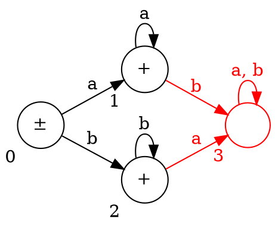
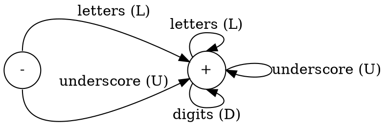
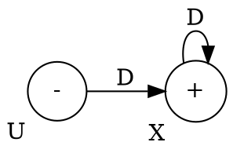
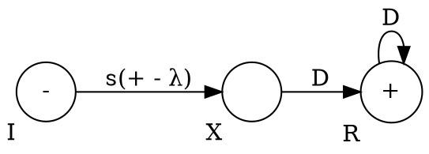

Given CFG:

$$
\begin{aligned}
E \to E + T \\
E \to E - T \\
E \to T \\
T \to T * F \\
T \to T / F \\
T \to F \\
F \to (E) \\
F \to a \\
F \to b \\
\end{aligned}
$$

- $E$: expression
- $T$: term
- $F$: factor

```
                E
                |
              --T--
            /   |   \
           T    *    F
          /         /|\
         F         / E \
        /|\       (  |  )
       / E \        /|\
   1> ( /|\ )      E - T
       E + T       |   |
       | ^ |       T   F
       T 3 F       |   |
       |   |       F   b
       F   b       |
       |           a
    2> a
==================================
      (a + b)   * (a - b)
```

$$
\begin{aligned}
E &\to \underline{T} \\
  &\Rightarrow \underline{T} * F \\
  &\Rightarrow \underline{F} * F \\
  &\Rightarrow (\underline{E}) * F \\
  &\Rightarrow (\underline{E} + T) * F \\
  &\Rightarrow (\underline{T} + T) * F \\
  &\Rightarrow (\underline{F} + T) * F \\
  &\Rightarrow (a + \underline{T}) * F \\
  &\Rightarrow (a + \underline{F}) * F \\
  &\Rightarrow (a + b) * \underline{F} \\
  &\Rightarrow (a + b) * (\underline{E}) \\
  &\Rightarrow (a + b) * (\underline{E} - T) \\
  &\Rightarrow (a + b) * (\underline{T} - T) \\
  &\Rightarrow (a + b) * (\underline{F} - T) \\
  &\Rightarrow (a + b) * (a - \underline{T}) \\
  &\Rightarrow (a + b) * (a - \underline{F}) \\
  &\Rightarrow (a + b) * (a - b) \\
\end{aligned}
$$

- Terminals: $\{\texttt{a}, \texttt{b}, \texttt{+}, \texttt{-}, \texttt{*}, \texttt{/}, \texttt{(}, \texttt{)}\}$
- Non-terminals: $\{E, T, F\}$

---

Write a program for the following FA to decide whether input $w$ is accepted or
not.



Make sure that the states are complete by ensuring that there are $a$ and $b$
edges out of every state.

To pass all information from FA to a C++ program:

| State / Input | `a = 0` | `b = 1` |
| ------------- | ------- | ------- |
| `0`           | `1`     | `2`     |
| `1`           | `1`     | `3`     |
| `2`           | `3`     | `2`     |
| `3`           | `3`     | `3`     |

```c
bool isAccepted(const char* w) {
	int table[4][2] = {
		{1, 2},
		{1, 3},
		{3, 2},
		{3, 3}
	};

	int col = 0;
	int state = 0;

	for (int i = 0; i < strlen(w); i++) {
		switch (w[i]) {
		case 'a': col = 0; break;
		case 'b': col = 1; break;
		case '$': return state == 0 || state == 1 || state == 2;
		}
		state = table[state][col];
	}

	// int state = 0;
	// while (*w) {
	// 	state = table[state][*w - 'a'];
	// 	++w;
	// }
	// return state == 3;
}
```

Given `isAccepted("ba$")`:

| `i` | `col` | `state`                      |
| --- | ----- | ---------------------------- |
| `0` | `1`   | `table[0][1] = 2`            |
| `1` | `0`   | `table[2][0] = 3` (rejected) |

---

**Defn**: An identifier is a string of `[A-Za-z0-9_]`. Identifiers must start
with a letter or underscore.



$<id> \to (L + U) (L + D + U)^*$

---

Write a CFG for numbers in C++:

```
 25 - unsigned
-25 - signed
```

Examples: .25, 25., -.25, -25, 123.25, +123.25, -123.25

##### Unsigned



$$
\begin{aligned}
U &\to DX \\
X &\to DX | \lambda \\
\end{aligned}
$$

##### Signed



---

CFG for functions!

```c
int f()
int f(int a)
int f(int a, int b)
```

$$
\begin{aligned}
<\text{func_heading}> &\to <\text{type}> <\text{id}> \texttt{(} <\text{params}> \texttt{)} \\
<\text{type}> &\to \texttt{void} | \texttt{int} | \texttt{float} | \texttt{double} | \texttt{char} \\
<\text{id}> &\to \texttt{[A-Za-z_][A-Za-z0-9_]*} \\
<\text{params}> &\to <\text{param_list}> \\
<\text{param_list}> &\to \lambda | <\text{type}> <\text{id}> | <\text{type}> <\text{id}> \texttt{,} A \\
\end{aligned}
$$
