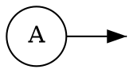
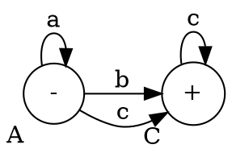
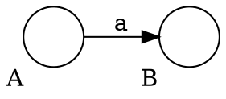
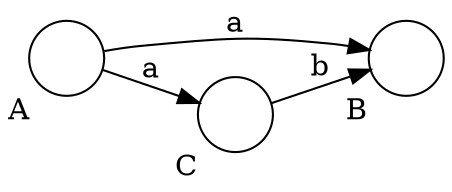
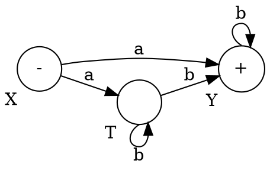
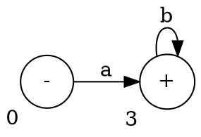
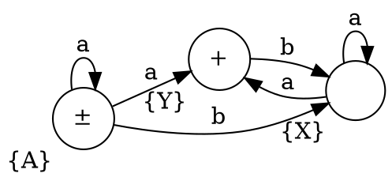
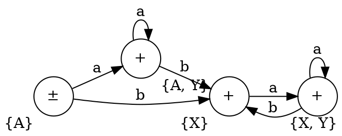

# Handout #3

- Other forms of CFG
- Regular and non-regular languages
- Regular and non-regular CFGs
- Converting non-deterministic FAs to deterministic FAs

## Notations

- $S \to [a]$ means either $S \to a$ or $S \to \lambda$.
- $S \to \{a\}$ means $S \to a^*$.
- $S \to a | b$ means $S \to a$ or $S \to b$.



## BNF (Backus-Naur Form)

CFG:

$$
\begin{aligned}
A &\to aA | bB | \lambda \\
B &\to bB | \lambda
\end{aligned}
$$

BNF:

$$
\begin{aligned}
A &\to aA \\
A &\to bB \\
B &\to bB \\
A &\to \lambda \\
B &\to \lambda
\end{aligned}
$$

Extended BNF: allows $[, ], |, \{, \}$

$$
\begin{aligned}
L &= a^* b^* \\
\text{EBNF: } S &\to \{a\} \{b\}
\end{aligned}
$$

### Examples

- $L = (a+b)^*$, EBNF: $S \to \{a|b\}$
- $L = a^* + b^*$, EBNF: $S \to \{a\} | \{b\}$

$L =a^* (b+c) c^*$

FA:



CFG:

$$
\begin{aligned}
A &\to aA | bC | cC \\
C &\to cC | \lambda
\end{aligned}
$$

EBNF:

$S \to \{a\} (b|c) \{c\}$

             --d-v
	S ------|    |-------->
	   ^-a-  --c-^   ^-c-

---

## Regular and non-regular languages

**Defn**: A CFG is regular if each rule is uniform.

CFG is not regular if on the right-hand side there are more than one
non-terminal.

## Non-deterministic FAs

Deterministic:



Non-deterministic:



Program doesn't know whether to go to B or C.

### Conversion



```
Input/State		a       b
-----------------------------
0. {X}			{Y, T}  {}
1. {Y}			{}      {Y}
2. {T}			{}      {T, Y}
------------------------------
3. {Y, T}		{}      {Y, T}
```



***



```
Input/State		a       b
-----------------------------
0. {A}			{A, Y}  {X}
1. {X}			{X, Y}  { }
2. {Y}			{ }     {X}
------------------------------
3. {Y, T}		{A, Y}  {X}
4. {X, Y}		{X, Y}  {X}
```

becomes


