# Handout 4

- Converting non-deterministic CFG to deterministic CFG
- Give language $L$, find $\bar{L}$
- Removing $\lambda$ from FA and CFG
- Removing unit production $A \to B$ from CFG

---

## Converting non-deterministic CFG to deterministic CFG

**Example**: convert the following CFG to deterministic CFG:

$$
\begin{aligned}
A &\to aA | aB \\
B &\to bB | bA | \lambda
\end{aligned}
$$

1. Construct FA from NDCFG

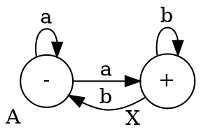

2. Construct table

| State/Input | a        | b        |
| ----------- | -------- | -------- |
| $\{A\}$     | \{A, B\} | \{\}     |
| $\{B\}$     | \{\}     | \{A, B\} |
| $\{A, B\}$  | \{A, B\} | \{A, B\} |

3. Construct DFA from table

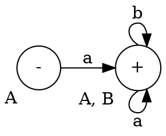

Therefore, the determinant CFG is:

$$
\begin{aligned}
A &\to aX \\
X &\to aX | bX | \lambda
\end{aligned}
$$

---

## Given language $L$, find $\bar{L}$

**Example**: Given $L = ab^* + ba^*$, find $\bar{L}$

$\Sigma = \{a, b\}$

1. Generate an NDFA for $L$

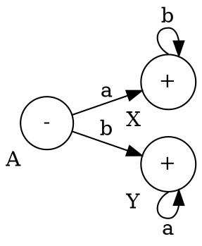

2. Complete the NDFA

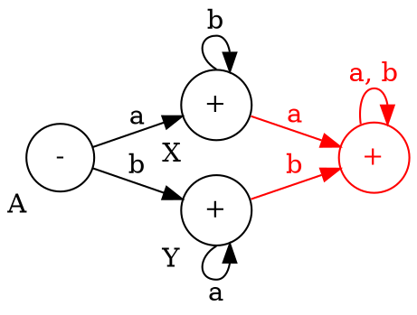

3. Change the behavior of each state using the following table:

| original  | complement |
| --------- | ---------- |
| $-$       | $\plusmn$  |
| $\plusmn$ | $-$        |
| $\space$  | $+$        |
| $+$       | $\space$   |

4. Find complement of FA by changing the behavior of each state:

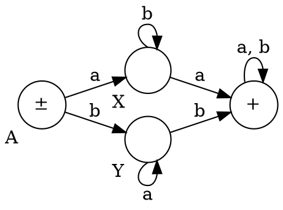

$$
\begin{aligned}
     L  &= ab^* + ba^* \\
\bar{L} &= \lambda + ab^*a (a+b)^* + ba^* b (a+b)^* \\
\end{aligned}
$$

**Example**: $L = (a+b)^*$

1. Generate DFA for $L$

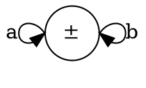

2. Complete the FA

It looks the same as the original one.

3. Completed FA

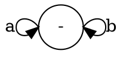

$L = \{\}$ because the complement FA doesn't accept any string.

---

## Removing $\lambda$ from FA and CFG

### Removing $\lambda$ from CFG

**Example**: Remove $\lambda$ from the following CFG: $S \to aSb | \lambda$

- $S \to aSb \implies S \to aSb$
- $S \to a\lambda b \implies S \to ab$

Tree 1:

- S
  - a (a)
  - S ($\lambda$)
  - b
    - ab (ab)

Tree 2:

- S
  - ab (ab)

 

**Example**: $S \to AB$

- $S \to AB$
  - $\implies S \to A \lambda \implies S \to A$
    - $\implies S \to aA \implies S \to a\lambda \implies S \to a$
  - $\implies S \to \lambda B \implies S \to B$
    - $\implies S \to bB \implies S \to b\lambda \implies S \to b$
  - $\implies S \to AB | a | b$
- $A \to aA | \lambda \implies A \to aA | a$
- $B \to bB | \lambda \implies B \to bB | b$

Tree final:

- $S$
  - $a$
- $S$
  - $b$
- $S$
  - $a$ ($a$)
  - $b = ab$ ($b$)

 

**Example**:

- $S \to aaBb$
- $B \to bB | \lambda$

Removing $\lambda$:

- $S \to aaBb$
  - $\implies S \to aaBb \implies S \to aaBb$
  - $\implies S \to aa\lambda b \implies S \to aab$
- $B \to bB | \lambda$
  - $\implies B \to bB | b$

 

**Example**:

- $S \to aX$
  - $\implies S \to aX$
  - $\implies S \to a\lambda \implies S \to a$
- $X \to aX | bX | \lambda$
  - $X \to aX | bX | a | b$

### Removing $\lambda$ from FA

**Example**: Remove $\lambda$ from the following FA: $L = a^* b^*$

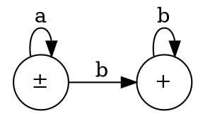

This FA is equivalent to:

However, this FA has two initial states, so it's invalid. We can instead do:

We can now construct a transition table to remove $\lambda$ from the FA:

|         | $a$     | $b$     |
| ------- | ------- | ------- |
| $\{A\}$ | $\{A\}$ | $\{B\}$ |
| $\{B\}$ | $\{\}$  | $\{B\}$ |

Then, we can construct the new FA:

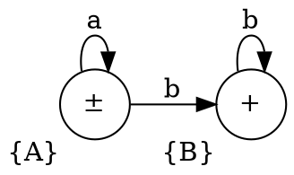

This FA is the same as the original one.

 

**Example**: $L = a^* + b^*$

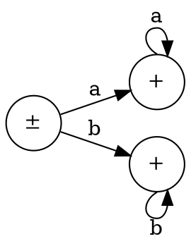

We can split the FA into two FAs:

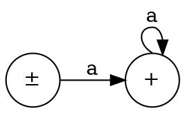

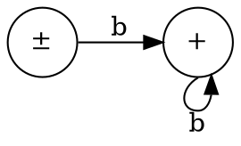

Make a new FA:

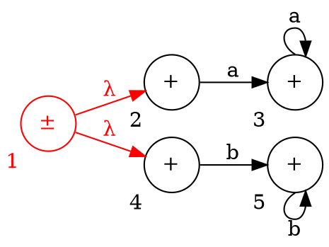

Then the transition table:

|         | $a$     | $b$     |
| ------- | ------- | ------- |
| $\{1\}$ | $\{3\}$ | $\{5\}$ |
| $\{2\}$ | $\{3\}$ | $\{\}$  |
| $\{3\}$ | $\{3\}$ | $\{\}$  |
| $\{4\}$ | $\{\}$  | $\{5\}$ |
| $\{5\}$ | $\{\}$  | $\{5\}$ |

Then the FA from the transition table:

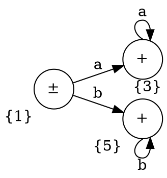

This FA is the same as the original one.

---

**Example**: $L = a^* + b^* c^*$ (EBNF: $S = \{a\} | \{b\} \{c\}$)

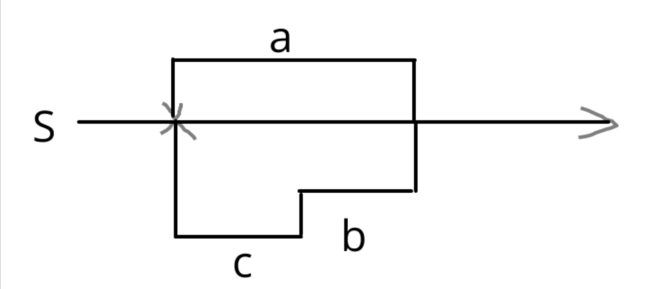

---

## Removing unit productions

**Example**:

- $S \to A | aa$
- $A \to B | b$
- $B \to S | a$

There are 3 unit productions:

- $S \to A$
- $A \to B$
- $B \to S$

We'll remove them by doing:

- $S \to A | aa$
  - $\implies S \to aa$
  - $\implies S \to A \to b \implies S \to b$
    - $\implies S \to b$
  - $\implies S \to A \to B \to a \implies A \to a$
    - $\implies S \to a$
- $A \to B | b$
  - $\implies A \to b$
  - $\implies A \to B \to S$
    - $\implies A \to aa$
    - $\implies A \to b$
    - $\implies A \to a$
- $B \to S | a$
  - $\implies B \to a$
  - $\implies B \to S$
    - $\implies B \to aa$
    - $\implies B \to b$
    - $\implies B \to a$

Therefore:

- $S \to aa | a | b$
- $A \to aa | a | b$
- $B \to aa | a | b$

 

**Example**:

- $S \to AX$
- $A \to aA | X$
- $X \to bX | \lambda$

We have to remove $\lambda$ from $X$ first:

- $S \to AX$
- $A \to aA | \lambda \implies A \to aA | a$
- $X \to bX | b$

Then continue with the rest.
