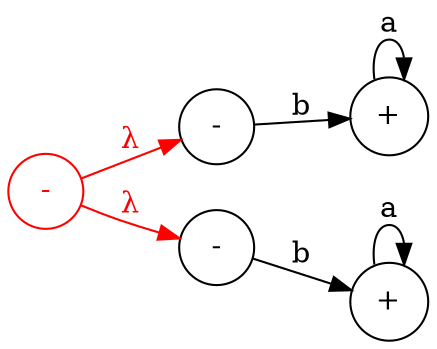
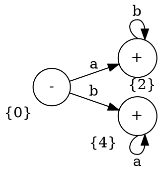
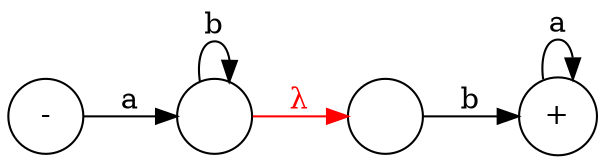
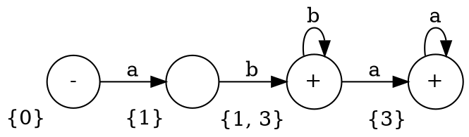
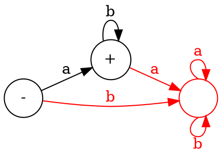
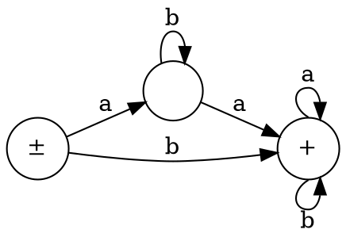
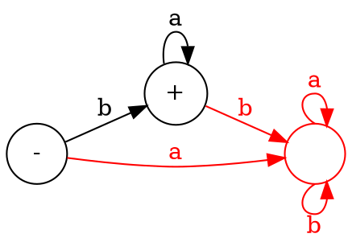
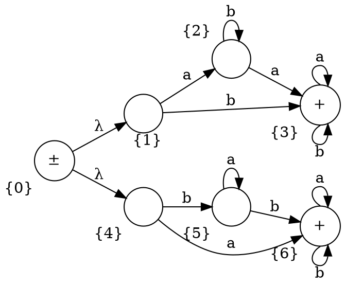
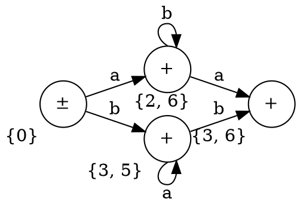
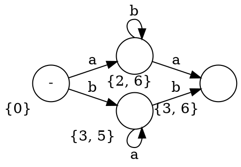

### Schedule

- This week (n)
  - ???
  - Passed homework
- Next week (n+1)
  - Lecture x2
- Week after (n+2)
  - Tuesday: Review
  - Thursday: Exam 1 part 1
- Week n + 3
  - Tuesday: Exam 1 part 2

# Handout 5

- Applications of removing $\lambda$ from FA
  - Given $L_1 = ab^*, L_2 = ba^*$, find $L_1 \cup L_2$

## Applications of removing $\lambda$ from FA

**Example**: Given $L_1 = ab^*, L_2 = ba^*$:

1. Find $L_1 \cup L_2$
2. Find $(L_1)(L_2)$
3. Find $L_1 \cap L_2$

#### Find $L_1 \cup L_2$

Suppose FA1 has language $L_1$ and FA2 has language $L_2$. To find $L_1 \cup
L_2$, we can construct a new FA that is FA1 $\cup$ FA2:

Then, construct a transition table for the new FA:

|         | $a$     | $b$     |
| ------- | ------- | ------- |
| $\{0\}$ | $\{2\}$ | $\{4\}$ |
| $\{1\}$ | $\{2\}$ | $\{\}$  |
| $\{2\}$ | $\{\}$  | $\{2\}$ |
| $\{3\}$ | $\{\}$  | $\{4\}$ |
| $\{4\}$ | $\{4\}$ | $\{\}$  |

Then, construct an FA from the transition table:

Note that $\{1\}$ and $\{3\}$ are not reachable from $\{0\}$, so they are not
part of the language.

So

$$
\begin{aligned}
\text{FA} &= \text{FA}_1 \cup \text{FA}_2 & \\
L &= L_1 \cup L_2 \\
  &= ab^* + ba^*
\end{aligned}
$$

#### Find $(L_1)(L_2)$

Suppose 2 FAs. Make the new FA:

To remove $\lambda$, we construct a transition table:

|            | $a$     | $b$                                         |
| ---------- | ------- | ------------------------------------------- |
| $\{0\}$    | $\{1\}$ | $\{\}$                                      |
| $\{1\}$    | $\{\}$  | $\{1, 3\}$ (keep traversing past $\lambda$) |
| $\{2\}$    | $\{\}$  | $\{3\}$                                     |
| $\{3\}$    | $\{3\}$ | $\{\}$                                      |
| $\{1, 3\}$ | $\{3\}$ | $\{1, 3\}$                                  |

Then, construct an FA from the transition table:

So

$$
\begin{aligned}
L &= (L_1)(L_2) \\
  &= abb^* + abb^* aa^* \\
  &= abb^* (\lambda + aa^*) \\
  &= abb^* a^* \\
  &= ab^* ba^*
\end{aligned}
$$

#### Find $L_1 \cap L_2$

$$
\begin{aligned}
L &= L_1 \cap L_2 = \{\} = \emptyset
\end{aligned}
$$

or

$$
\begin{aligned}
L &= L_1 \cap L_2 \\
  &= \text{FA}_1 \cap \text{FA}_2 \\
  &= \overline{\overline{\text{FA}_1 \cap \text{FA}_2}} \\
  &= \overline{\overline{\text{FA}_1} \cup \overline{\text{FA}_2}} \\
\end{aligned}
$$

Construct the FA for $\text{FA}_1$ and complete it:

Then, construct the FA for $\overline{\text{FA}_1}$:

Then, construct the FA for $\text{FA}_2$ and complete it:

Then, construct the FA for $\overline{\text{FA}_2}$:

Then, construct the FA for $\overline{\text{FA}_1} \cup \overline{\text{FA}_2}$:

Then, construct the transition table:

|            | a          | b          |
| :--------- | :--------- | :--------- |
| $\{0\}$    | $\{2, 6\}$ | $\{3, 5\}$ |
| $\{1\}$    | $\{2\}$    | $\{3\}$    |
| $\{2\}$    | $\{3\}$    | $\{2\}$    |
| $\{3\}$    | $\{3\}$    | $\{3\}$    |
| $\{4\}$    | $\{6\}$    | $\{5\}$    |
| $\{5\}$    | $\{5\}$    | $\{6\}$    |
| $\{6\}$    | $\{6\}$    | $\{6\}$    |
| $\{2, 6\}$ | $\{3, 6\}$ | $\{2, 6\}$ |
| $\{3, 5\}$ | $\{3, 5\}$ | $\{3, 6\}$ |
| $\{3, 6\}$ | $\{3, 6\}$ | $\{3, 6\}$ |

Then, construct the FA using the transition table above:

This is the FA for $\overline{\text{FA}_1} \cup \overline{\text{FA}_2}$. Let's
construct the complement of it:

There is no starting state in this FA, therefore this machine does not accept
any string. This is $\overline{\overline{\text{FA}_1} \cup
\overline{\text{FA}_2}}$.
