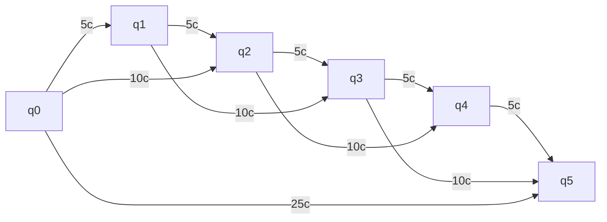
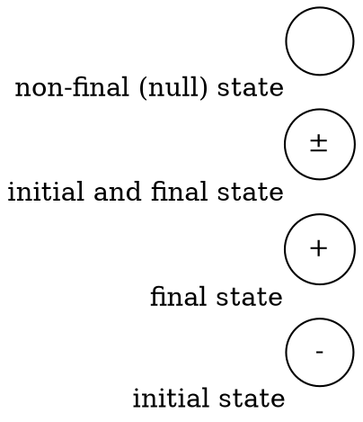
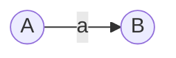
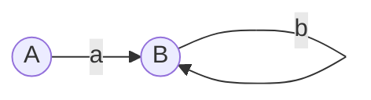
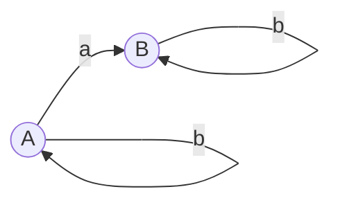
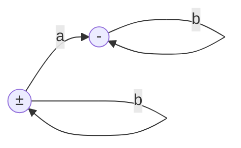
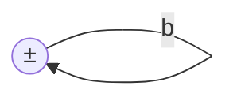
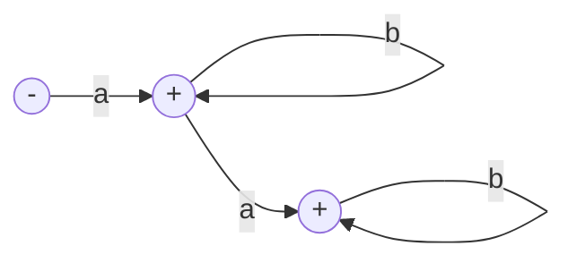

# Alphabets

- $\Sigma$: set of all symbols
- $w$: word (combo of symbols)
- $|w|$: length of word
- $\lambda$: empty (null) word
	- $w = a \lambda \lambda b = a b$
- $w^0 = \lambda$, $w^2 = ww$
- $w^2 = (ab)^2 = abab \not= a^2b^2$ (not the right order)
- $\Sigma^* = \Sigma \cup \{ \lambda \}$
- $+$: or
	- $a^* + b^* = a^* \cup b^*$
- Language is a subset of $\Sigma^*$
	- $a^* = \{ \lambda, a, a^2, ... \}$
	- Set of all powers of $a$ starting from 0.	
		- $\{ a, a^2, ... \}=$
			- $a \{ \lambda, a, a^2, ... \} = aa^* = a$
			- $\{ \lambda, a, a^2, ... \} a = a^*a = a$
- $a^* b^* = \{\lambda \lambda, a \lambda, \lambda b, ab, ...\} = \{\lambda,
  a, b, ab, ...\}$
  	- Must be ordered!! $ab \in a^* b^*$

# Finite Automata

Suppose we want to design a machine that accepts {5, 10, 25}c and return items
that cost {10, 15, 25}.

The machine does not return any changes.

> **Definition**: a Finite Automata consists of:
> 
> - Machine alphabet, e.g. $\Sigma = \{5c, 10c, 25c\}$
> - Set of states with exactly $1$ initial state, $\geq 1$ final states, and $\geq
>   0$ null state.

States:

- Set of states: $\{q_0, q_1, q_2, q_3, q_4, q_5\}$
- Initial state: $q_0$
- Final states: $\{q_2, q_3, q_5\}$
- Null: $\{q_1, q_4\}$

Representations:

1. Transition Diagram:

	|    | q0 | q1 | q2 | q3 | q4 | q5 |
	|----|----|----|----|----|----|----|
	| q0 |    | 5  | 10 |    |    | 25 |
	| q1 |    |    | 5  | 10 |    |    |
	| q2 |    |    |    | 5  | 10 |    |
	| q3 |    |    |    |    |    |    |
	| q4 |    |    |    |    |    |    |
	| q5 |    |    |    |    |    |    |

2. Grammar

	$$
  \begin{aligned}
	<q_0> &\to 5<q_1> \\
  <q_0> &\to 10<q_2> \\
  <q_0> &\to 25<q_5> \\
  & \ \ \ \vdots \\
  <q_2> &\to \lambda \text{ (final state)} \\
  <q_3> &\to \lambda \\
  <q_5> &\to \lambda \\
  \end{aligned}
	$$

**Note**: if upper-case letters are used, then angle brackets are not needed.

## Notations

---

**Example**: find all words of $L = (a+b)^*$

$$
\begin{aligned}
L &= \{ (a+b)^0, (a+b)^1, (a+b)^2, ... \} \\
  &= \{ \lambda, a, b, aa, ab, ba, bb, aaa, aab, aba, abb, baa, bab, bba, bbb, ... \} \\
\end{aligned}
$$

---

**Example**: find the languages and grammars

1.

- Language: 
	- $\Sigma = \{a\}$
	- $L = \{a\}$
- Grammar:
	- $A \to aB$
	- $B \to \lambda$

2.

- Language:
	- $\Sigma = \{a, b\}$
	- $L = \{a, ab, abb, abbb, ...\}$

3.

- Language:
	- $\Sigma = \{a, b\}$
	- $L = b^* a b^*$
- Grammar:
	- $A \to aB$
	- $A \to bA$
	- $B \to bB$
	- $B \to \lambda$

4.

- Language:
	- $\Sigma = \{a, b\}$
	- $\begin{aligned}
	  L &= \{\lambda\} + b^* + b^* a b^* \\
	    &= b^* + b^* a b^* \\
		&= b^* (\lambda + ab^*) \text{ or } (\lambda + b^* a) b^*
	  \end{aligned}$

5.

- Language: $L = (a+b)^*$
- Grammar:
	- $X \to aX$
	- $X \to bX$
	- $X \to \lambda$

6.

- Language: $L = ab^* + ab^* ab^*$
