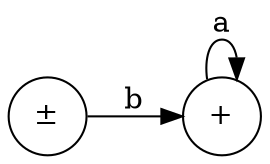
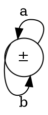
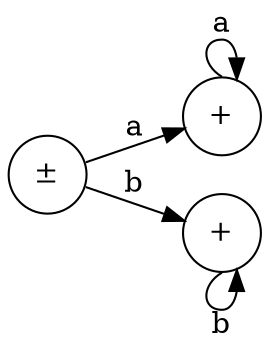
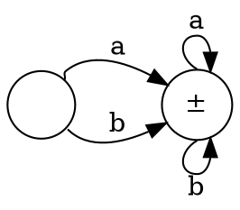
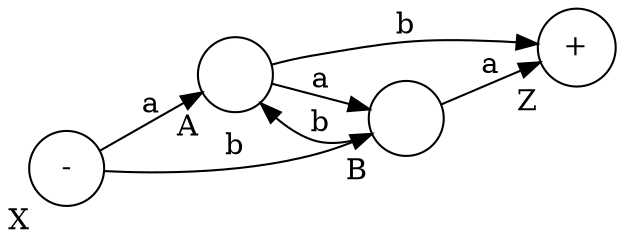
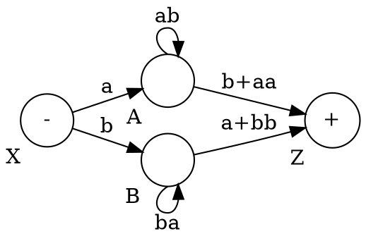
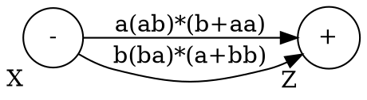
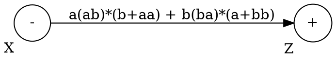

$$
\begin{aligned}
L &= L_1 + L_2 \\
  &= \lambda + ba^* \\
L_1 &= \lambda \\
L_2 &= ba^*
\end{aligned}
$$

We use two $L$s because we have 2 final nodes.

---

$$
\begin{aligned}
L &= (a+b)^* \\
\end{aligned}
$$

---

$$
\begin{aligned}
L &= a^* + b^* \\
\end{aligned}
$$

---

**Note**: $a^* b^*$ is **ordered**. Once $b$ is found, $a$ can't be found anymore.

---

$$
\begin{aligned}
L &= a(a+b)^* + b(a+b)^* \\
  &= (a+b)(a+b)^* \\
\end{aligned}
$$

---

simplifies to

simplifies to

simplifies to

